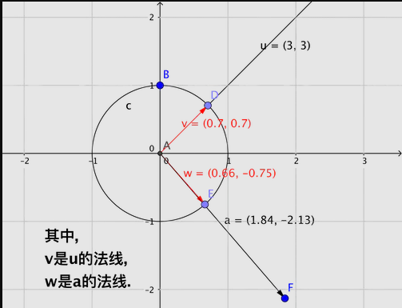
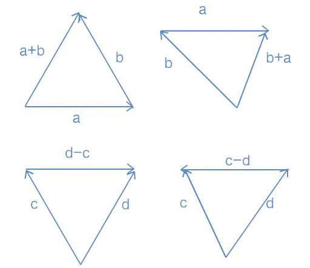
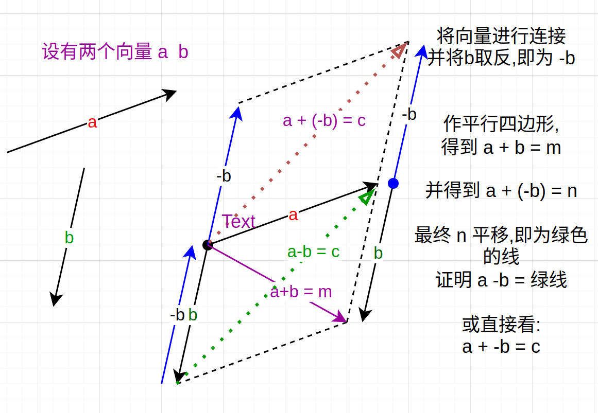
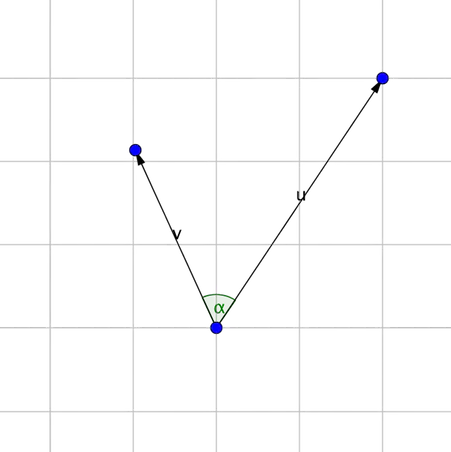
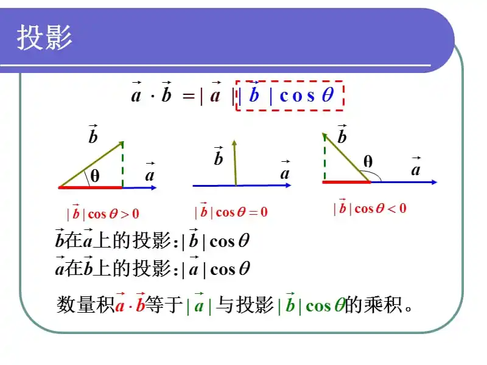
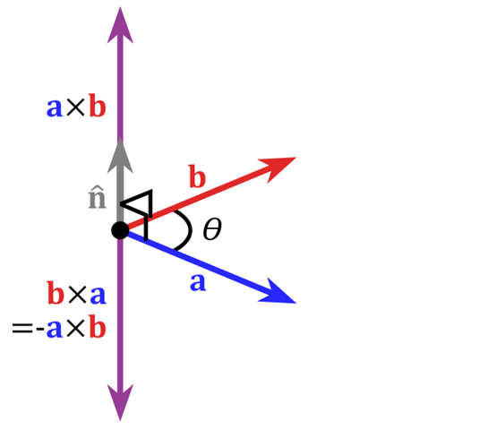
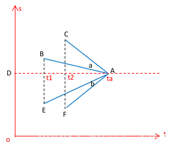
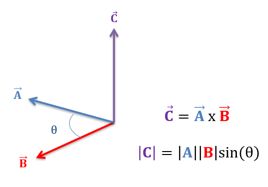
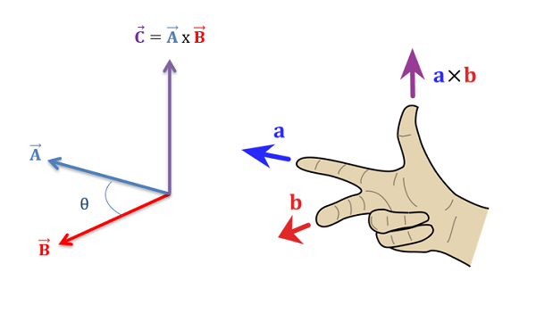

**向量  Vectors** 是由n个实数组成的一个n行1列 或一个1行n列 的有序数组；在二维空间中，一个向量可以用一对x和y来表示。例如由点（1,3）到（5,1)的向量可以用(4,-2）来表示。  

空间向量和平面向量夹角范围都是[0°,180°]。

向量AB = B - A   即B的坐标减去A 的坐标  
向量属性  
1、 向量的平移之后仍表示同一个向量  
2、 向量具有长度的属性 *|| a ||*  
3、 向量具有方向的属性 *可以利用向量除以自身的模长，得到单位向量用来表示方向*  

向量就是一个数字列表，对于程序员来说一个向量就是一个**数组。**  

向量的维度就是向量包含的“数”的数目，向量可以有任意正数维，标量可以被认为是一维向量。  

书写向量时，用方括号将一列数括起来，如[1,2,3] 水平书写的向量叫**行向量**,垂直书写的向量叫做**列向量**  

向量的几何意义  
几何意义上说，向量是有大小和方向的有向线段。向量的**大小**就是向量的长度**（模）**向量有非负的长度。  
向量的方向描述了空间中向量的指向。  

向量的形式：向量定义的两大要素——大小和方向

向量仅仅定义方向和长度。只要向量的大小和方向相同, 即视为相等的向量。

向量：`u=(u1,u2,u3) v=(v1,v2,v3)  `

叉积公式：`u x v = { u2v3-v2u3 , u3v1-v3u1 , u1v2-u2v1 }`  

点积公式：`u * v = u1v1 + u2v2 + u3v33 = lul lvl * Cos(U,V)`   

---

### 向量大小(向量的模)

将向量的各个分量的平方加起来然后进行开方得到的数值就是向量的模.数学表达式如下.

```cpp
‖ν‖ = √(v1²+v2²+...+vn-1²+vn²)
```

常用的只有2D和3D的向量的模的计算,数学表达式如下所示: (即,将向量当作直角三角形的斜边,通过勾股定理求出)

```cpp
//2D向量的模
‖ν‖ = √(vx²+vy²)

//3D向量的模
‖ν‖ = √(vx²+vy²+vz²)
```

---

### 法线(标准化向量)

对于许多向量，我们只关心向量的方向不在乎向量的大小，如：“我面向的是什么方向？”，在这样的情况下，使用**单位向量**非常方便，单位向量就是大小为1的向量，单位向量经常也被称作为**标准化向量**或者**法线。**  

对于任意非零向量v，都能计算出一个和v方向相同的单位向量k,这个过程被称作向量的“标准化”，要标准化向量，将向量除以它的大小（模）即可。  零向量不能被标准化，数学上这是不允许的，因为将导致除以零，几何上也没有意义，零向量没有方向。

数学表达式如下.

```undefined
ν0 = ν  /  ‖ν‖ , ν ≠  0
```

几何解释:

在向量ν的尾部简历坐标系,然后做单位圆,做一向量ν0与ν方向相同,尾部与原点相交,终点交于单位圆的一点.ν0就是ν的法线.



---

### 向量投影

给定两个向量v和n,能够将v分解成两个分量， 它们分别垂直和平行于向量n，并且满足 两向量相加等于向量v，一般称平行分量为v在向量n上的投影。    

**平行分量公式** ：平行分量 = **n**(**v**·**n**)/||**n**||^2
**垂直分量公式:** ： 垂直分量 = ||**v**|| – **n**(**v**·**n**)/||**n**||^2

---

### 向量的加法和减法

两个向量的维数相同，那么它们能相加，或者相减。结果向量的维数与原向量相同。向量加减法的记发和标量加减法的记法相同。

```cpp
 [a1,a2,...,an-1,an]  +  [b1,b2,...,bn-1,bn] = [a1+b1,a2+b2,...,an-1+bn-1 ,an+bn]

 [a1,a2,...,an-1,an]  -  [b1,b2,...,bn-1,bn] = [a1-b1,a2-b2,...,an-1-bn-1 ,an-bn]
```

例如：`[x,y,z] + [a,b,c] = [x+a,y+b,z+c]`
减法解释为加负向量，`a-b=a+(-b)` 

例如： `[x,y,z] – [a,b,c] = [x-a,y-b,c-z]`

向量不能与标量或维数不同的向量相加减。  
和标量加法一样，向量加法满足交换律，但向量减法不满足交换律，永远有a+b = b+a,但a-b=-(b-a),仅当a=b时，a-b = b-a

几何解释:   

向量a和向量b相加的几何解释为：平移向量，使向量a的头连接向量b的尾，接着从a的尾向b的头画一个向量。这就是向量加法的“三角形法则”。

向量加法的物理意义：

船过河问题：船头的位移（马达动力）、流水影响的位移（水速）、真正的位移




---

### 向量的数乘

标量与向量的乘法, 一个数值(标量Scalar) 乘以向量的每个分量, 就是将向量中的每个分量与标量相乘. 标量乘法和标量与向量的乘法可以省略乘号.

如将数值 2 与一个给定向量相乘, 意味着将这个向量拉长为原向量的 2 倍

```bash
κ [a1,a2,...,an-1,an] = [κa1,κa2,...,κan-1,κan]
```

几何解释:

一个标量κ乘以一个向量可以看做是这个向量的缩放变换.缩放了κ倍  

---

### 点乘（Dot Product）

"点乘"说的就是来自记法a·b中的点号.  

其数学表达式如下.

```csharp
 [a1,a2,...,an-1,an]·[b1,b2,...,bn-1,bn] = a1b1 + a2b2 +...+ an-1bn-1 + anbn
```

几何解释:

一般来说，点乘结果描述了两个向量的“相似”程度，点乘结果越大，两个向量越相近

点乘的结果就是两个向量的模相乘，然后再与这两个向量的夹角的余弦值相乘。或者说是两个向量的各个分量分别相乘的结果的和  [推导](https://blog.csdn.net/dcrmg/article/details/52416832)

`V1( x1, y1) · V2(x2, y2) = x1*x2 + y1*y2 = |V1| * |V2| * cosθ`  

向量的点乘,也叫向量的内积、数量积，对两个向量执行点乘运算，就是相应元素的乘积的和，点乘的结果是一个标量（Scalar）。

https://blog.csdn.net/dcrmg/article/details/52416832




| v · u | 角度α          | v与u方向关系              | 解释                        |
| ----- | ------------ | -------------------- | ------------------------- |
| >0    | 0°≤ α ＜90°   | 方向基本相同, 两个向量的夹角小于90度 | cosα的值在0 与1之间,所以值为正       |
| 0     | α = 90°      | 正交, 两个向量互相垂直         | cosα的值即为 cos90° = 0,所以值为0 |
| <0    | 90°≤ α ＜180° | 方向基本相反, 向量的夹角大于90度   | cosα的值在0 与 -1之间,所以值为负     |

---

### 叉乘 (CrossProduct)

"叉乘"来自记法中的a x b的叉号,叉号也是不能省略的.叉乘的结果不再是一个标量,而是一个向量.  叉乘不满足交换律。 它满足反交换律 a × b = -(b × a)  

具体的数学表达式如下所示.  

```cpp
 [x1,y1,z1] x [x2,y2,z2] = [y1z2-z1y2, z1x2-x1z2, x1y2-y1x2];
```

在三维几何中，向量a和向量b的叉乘结果是一个向量，更为熟知的叫法是法向量，该向量垂直于a和b向量构成的平面。  

在3D图像学中，叉乘的概念非常有用，可以通过两个向量的叉乘，生成第三个垂直于a，b的法向量，从而构建X、Y、Z坐标系。  

如下图所示：   

  
在二维空间中，叉乘还有另外一个几何意义就是：  

aXb等于由向量a和向量b构成的平行四边形的面积。  

- 二维向量叉乘

```cpp
A=(a1,a2)
B=(b1,b2)
A×B =(a1,a2) × (b1,b2) = a1 b2 - a2 b1
```

- 三维向量叉乘

```cpp
A=(a1,a2,a3)
B=(b1,b2,b3)

A×B  = (a1,a2,a3) × (b1,b2,b3)
= (a2b3-a3b2, a3b1-a1b3, a1b2-a2b1)
// 或
[x,y,z] × [a,b,c] = [yc-zb , za-xc , xb-ya]
```


几何意义是:算方向,算面积

[两个向量的叉乘为什么是面积？ - 知乎](https://www.zhihu.com/question/22902370/answer/293612432)

**为什么叉乘能代表方向? 因为
叉乘是 a X b =  |a||b|sinθ, 
点乘的 a . b = |a||b|conθ**

设二维向量：a = (a1, a2);     b = (b1, b2);
设三维向量：OA = (x1, y1, z1);    OB = (x2, y2, z2);

向量点乘积：a · b  =  a1 * b1 + a2 * b2 = |a| |b| cos<a, b>
~~向量单位化：a 单位化后的~~

~~na = (a1 / Math.sqrt(a1 * a1 + a2 * a2), a1 / Math.sqrt(a1 * a1 + a2 * a2))~~

向量叉乘积：
二维： a X b = (a1 * b2) - (a2 * b1)
三维：OA X OB = (y1 * z2 - y2 * z1, x2 * z1 - x1 * z2, x1 * y2 - x2 * y1)

**叉乘的几何意义**



如上图所示：
`AB x AC = |AB||AC|sin(a) `(a表示AB与AC的夹角），

根据叉乘的右手准则，ABx AC的朝向为sot平面的坐标负值方向。
`AE x AF = |AE||AF|sin(b)` (b表示AE与AF的夹角），

根据叉乘的右手准则，AE x AF的朝向为sot平面的坐标正值方向。

其**几何意义**是：

AB x AC的结果为负值，表明B、C两点是按顺时针方向移动；

AE x AF的结果为正值，表明E、F两点是按逆时针方向移动。

如果横坐标定义为时间t，纵坐标定义为位移s，且s(t)是t的非单调递减函数，且排除待测试的两个点出现跨越直线DA的情形（即待测试的两个点不能出现类似于E、B这个情形），则其几何意义是：AB x AC的结果为负值，表明B、C两点在A点上方；AE x AF的结果为正值，表明E、F两点在A点下方。
[出处](https://blog.csdn.net/davidhopper/article/details/124446056)




