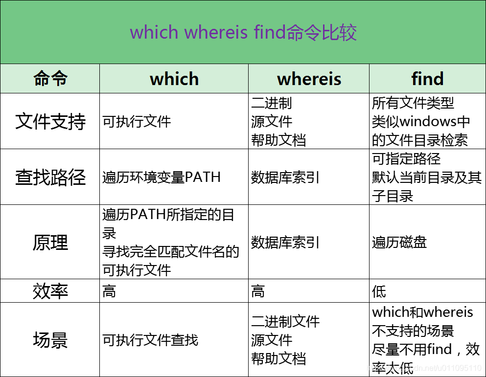

### 删除查询到的文件

文件夹下有文件为 1.78 以及 1.79 两个版本,现在需将有1.78文字的文件进行删除
查询命令为:   `ls| grep 1.78`
#Linux命令
现要将查询到的文件进行删除,则用如下命令:

`ls| grep 1.78 | xargs rm -r  `

解释:
**xargs**（英文全拼： eXtended ARGuments）

通俗的讲, 就是  
xargs 将前面命令的输出  作为参数  输入给后面的命令使用     

[linux查找命令which、whereis、find比较解析](https://blog.csdn.net/u011095110/article/details/83654929)

**按照文件名查找**  
[linux下的find文件查找命令与grep文件内容查找命令](https://blog.csdn.net/weixin_33736832/article/details/85547041)

`find / -name httpd.conf`　　#在根目录下查找文件httpd.conf，表示在整个硬盘查找  
`find /etc -name httpd.conf`　　#在/etc目录下文件httpd.conf  
`find /etc -name '*srm*'`　　#使用通配符*(0或者任意多个)。表示在/etc目录下查找文件名中含有字符串‘srm’的文件  
`find . -name 'srm*' `　　#表示当前目录下查找文件名开头是字符串‘srm’的文件

**`ls`**  List directory contents

**`cat`**  The cat command (short for “concatenate”) lists the contents of files to the terminal window

**`cd`** change directory.

**`cp`**  Copy a file

**`mv`** Move a file

**`rm`** This command is used to remove files in a directory or the directory itself.

**`chmod`** To change mode of a file system object.

**`chown`** This command is used to change the ownership

**`wc`** The wc (word count) command in Linux operating system is used to find out the number of new lines...

**`apt`** Advanced Packaging Tool
